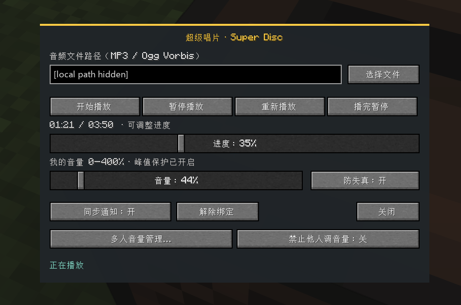
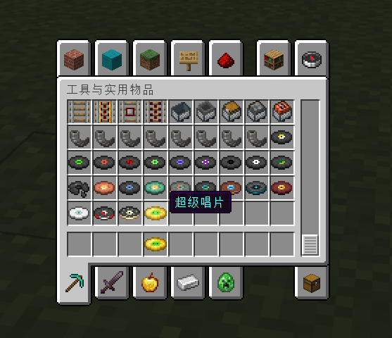

# Super Disc · 超级唱片

通过原版唱片机播放自选 MP3 / Ogg Vorbis 音乐，支持多人同步、独立音量和播放控制。

## 效果展示

播放控制界面：

创造模式物品栏：

## 支持范围

| Minecraft | 平台 | Java | 状态 |
| --- | --- | --- | --- |
| 1.20.1 | Forge 47.2.0+（47.x） | 17 | 测试版 |
| 1.21.1 | Forge 52.1.16+（52.x） | 21 | 实验性测试版 |
| 1.21.1 | NeoForge 21.1.251+（21.1.x） | 21 | 实验性测试版 |
| 1.21.1 | Fabric Loader 0.19.5+、Fabric API 0.116.17+1.21.1 | 21 | 实验性测试版 |
| 26.2 | Fabric Loader 0.19.5+、Fabric API 0.161.0+26.2 | 25 | 实验性测试版 |

当前测试版本：`2.1.0-alpha.3`。客户端与服务器必须安装相同平台、Minecraft 版本及模组版本。
不支持跨 Minecraft 版本或跨 Loader 联机。当前版本仍用于测试，尚未完成全面的音频、专用服务器及多人联机验证；建议先使用新世界体验，使用旧存档前请备份。

## 安装

从对应 Release 选择一个安装包，放入游戏或服务器的 `mods` 目录：

- Forge 1.20.1：`super-disc-2.1.0-alpha.3+mc1.20.1-forge.jar`
- Forge 1.21.1：`super-disc-2.1.0-alpha.3+mc1.21.1-forge.jar`
- NeoForge 1.21.1：`super-disc-2.1.0-alpha.3+mc1.21.1-neoforge.jar`
- Fabric 1.21.1：`super-disc-2.1.0-alpha.3+mc1.21.1-fabric.jar`，另装匹配的 Fabric API。
- Fabric 26.2：`super-disc-2.1.0-alpha.3+mc26.2-fabric.jar`，另装匹配的 Fabric API。

JLayer MP3 解码库已内嵌，不需额外安装。不要同时装入多个平台包，也不要安装 sources 或开发中间包。
发布包附带 `SHA256SUMS.txt`，可用 `Get-FileHash` 或 `sha256sum` 校验。

## 使用

用八个金锭围绕一个绿宝石合成超级唱片；也可从创造模式工具栏获取，
或使用 `/give @s super_disc:super_disc`。

1. 手持超级唱片右键原版唱片机，绑定并打开控制界面；先取出其中的原版唱片。
2. 选择或拖入 `.mp3` / `.ogg` 文件，也可输入完整文件路径。文件会自动校验并同步给收听者。
3. 使用开始、暂停、重新播放和循环控制。取消文件选择不会停止现有音乐。
4. 已绑定的唱片机无需手持物品即可打开；“解除绑定”会停止自定义播放并恢复原版交互。

超级唱片是可重复使用的控制物品，不插入原版唱片槽，也不会因绑定而消耗。
本地绝对路径不向其他玩家发送；同步内容包含音频文件、文件名及必要播放元数据。

## 联机与音量

- 音频导入者可调整进度；本次播放发起者可管理多人音量。
- 每位玩家、每台唱片机独立设置音量，范围为 0–400%。
- “禁止他人调音量”由本人控制，服务器验证每次管理操作。
- “防失真”默认开启，仅作用于本机，以 PCM 峰值限制增益；它与多人音量保护是不同设置。
- 关闭防失真后，高增益可能削波破音；保护不能修复原音频或设备失真。
- 收听者同步完成后预约播放；中途靠近或加入会补同步。网络和音频设备仍可能造成时间误差。
- 使用游戏唱片声音分类和位置衰减，约 16 格听觉范围；提高音量不会扩大范围。
- 破坏唱片机会停止播放；服务器重启保留绑定和进度，默认暂停。

## 文件与限制

缓存位于实际游戏工作目录的 `super_disc/` 下，支持启动器版本隔离。
客户端偏好保存于 `super_disc/client.properties`，音频和 PCM 缓存位于 `super_disc/audio_cache/`。
模组不会删除导入的源文件；主动清空路径会取消同步，完整缓存仍保留。
服务器及收听客户端会保存共享音频，请只分享有权分发的内容。

- 单个文件最多 32 MiB、20 分钟；PCM 缓存最多 256 MiB。
- `.ogg` 仅支持 Vorbis，不支持 Opus。
- 每个世界最多绑定 256 台唱片机，最多同时播放 32 台。
- 失败或超时会暂停并提示；首次同步、解码速度受网络和设备影响。
- Fabric 使用独立的版本适配，未承诺读取 Forge 的历史存档数据。

## 反馈与许可

反馈时附上 Minecraft、Loader、Java 和模组版本，以及已去除个人信息的相关日志。
项目保留原有 All Rights Reserved 声明；JLayer 的 LGPL 许可证及源码归档随安装包提供。

开发相关内容见 [开发文档](docs/DEVELOPMENT.md)。

## [2.1.0-alpha.3] - 2026-09-25

- 修复 1.21.1 Fabric、Forge、NeoForge 的播放控制页和多人音量页文字被模糊遮挡的问题。
- Fabric 26.2 的界面改用清晰的半透明背景，保留游戏字幕。
- Forge 1.20.1 的界面行为保持不变。
